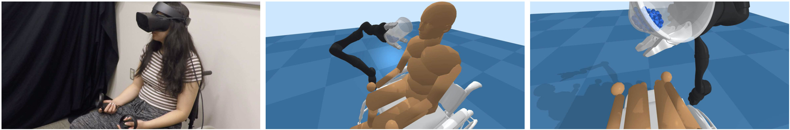
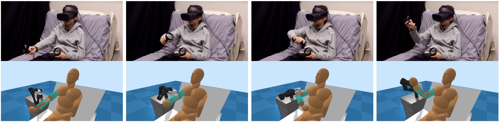

# Assistive VR Gym

Assistive VR Gym (AVR Gym) is a virtual reality framework that enables real people to interact with virtual assistive robots through physics simulation.

With virtual reality, simulation-trained assistive robots can be evaluated with real human motion/actions without putting real people at risk.
In doing so, VR can help bridge the gap between simulations and the real world.
AVR Gym is built on [Assistive Gym](https://github.com/Healthcare-Robotics/assistive-gym), a physics-based simulation framework for physical human-robot interaction and robotic assistance.





### Paper
A paper on Assistive VR Gym can be found at https://arxiv.org/abs/2007.04959

Z. Erickson*, Y. Gu*, and C. C. Kemp, "Assistive VR Gym: Using Interactions with Real People to Improve Virtual Assistive Robots", IEEE International Conference on Robot and Human Interactive Communication (RO-MAN), 2020.
```
@article{erickson2020avrgym,
  title={Assistive VR Gym: Using Interactions with Real People to Improve Virtual Assistive Robots},
  author={Erickson, Zackory and Gu, Yijun and Kemp, Charles C.},
  journal={IEEE International Conference on Robot and Human Interactive Communication (RO-MAN)},
  year={2020}
}
```

## Assistive Gym Install
### Simple installation using a python virtual environment.
We encourage installing Assistive Gym and the custom PyBullet engine in a python virtualenv.  
A detailed description of each installation step can be found in the [Install Guide](https://github.com/Healthcare-Robotics/assistive-gym/wiki/1.-Install).  
Installation instructions for Windows can also be found in the [Install Guide](https://github.com/Healthcare-Robotics/assistive-gym/wiki/1.-Install#installing-on-windows)
```bash
python3 -m pip install --user virtualenv
python3 -m venv env
source env/bin/activate
pip3 install git+https://github.com/Zackory/bullet3.git
git clone https://github.com/Healthcare-Robotics/assistive-gym.git
cd assistive-gym
pip3 install .
# Leave virtual env with: deactivate
```

## Virtual Reality Installation
Wiki page for VR installation under development.

## Getting Started
Wiki page for VR quick start under development.

We provide pretrained control policies for each robot and assistive task.  
See [Running Pretrained Policies](https://github.com/Healthcare-Robotics/assistive-gym/wiki/4.-Running-Pretrained-Policies) for details on how to run a pretrained policy.

